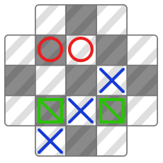

# Omni Tic-Tac-Toe

A strategy-chance-based spinoff of the popular game Tic-Tac-Toe!

## How to play Omni Tic-Tac-Toe

### Game Loop

#### Starting A Turn
Before each player starts their turn, the player will first roll a dice between 1 to 4, which will determine the number of credits that they have for that turn.

#### Playing A Turn
Once the dice has been rolled, the player can perform a number of actions, which cost them a different number of credits, namely:

| Action | Cost |
| ------ | ---- |
| Place/Move a tile of their own | 2 |
| Remove an opponent's tile | 3 |
| Place/Move a defending tile | 1 |

##### Performing the Actions

On an empty tile:
- If the number of credits equals or is more than 2:
- - Click once to place your own tile (if there are available slots for your own tiles).
- - Click twice to place a defender (if there are available slots for defenders).
- - Click thrice to remove the tile.

- If the number of credits equals 1:
- - Click once to place a defender (if there are available slots for defenders).
- - Click twice to remove the tile.

On an occupied tile:
- Click once to select the tile (if the tile is an opponent's tile, it will remove the tile).
- Click elsewhere to move the tile to that position (if the tile is your own or a defender).

#### Ending A Turn
After performing the actions, the player can end their turn for the next player to start turn. If there are leftover credits that are not used, they will be discarded.

### Game Objective
To win, players have to get 3 of their tiles to be in a straight or diagonal line, just like in the original Tic-Tac-Toe.

### Restrictions
However, there are some limits pertaining to the number of tiles that the board can have:
There can only be 4 tiles for each player and 2 defenders on the board.
